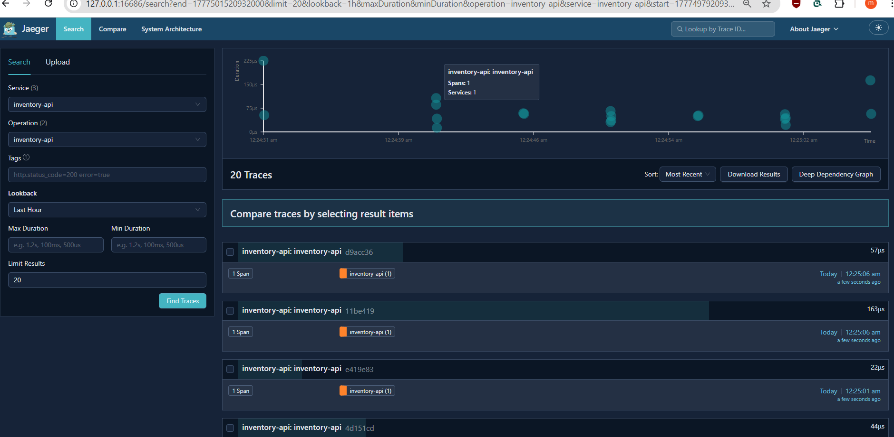
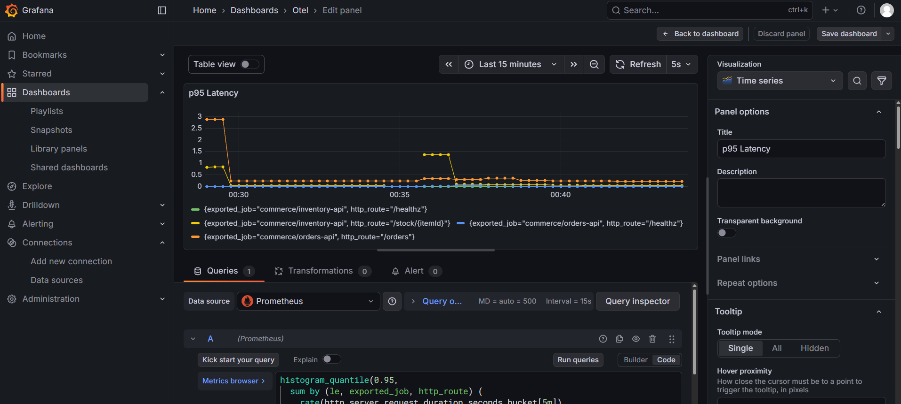
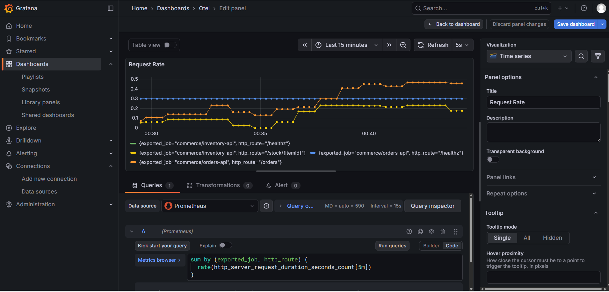

# otel-heterogeneous-reference

> Reference implementation of a Telemetry Minimum Standard (MVS) across heterogeneous services using OpenTelemetry.

**Status**: **Status**: v1 complete. See [Roadmap](#roadmap) for v2 scope.

## What this is

An end-to-end example of instrumenting a multi-language, multi-service application on Kubernetes with OpenTelemetry — traces, metrics, and logs — exported to vendor-neutral backends (Jaeger, Prometheus, Loki). Every telemetry decision is driven by a Telemetry Minimum Standard (MVS) document that services must conform to.

Companion artifact to an ongoing Master's thesis on enterprise observability standardization in heterogeneous IT landscapes.

## Why this exists

Most observability tutorials instrument a single service in a single language and call it done. Real enterprises run heterogeneous stacks — .NET, Java, Go, Python — with inconsistent telemetry conventions, unreliable trace propagation, and dashboards that don't compose across teams. This project demonstrates a different approach: **define the standard first, implement it identically across languages, keep the backend plug-replaceable.**

## Architecture

_Architecture diagram coming soon._

The system consists of:

- **orders-api** — .NET 8 minimal API, calls inventory-api to validate stock
- **inventory-api** — Go service returning stock availability
- **OpenTelemetry Collector** — agent (DaemonSet) + gateway (Deployment) pattern
- **Jaeger** — trace backend
- **Prometheus + Alertmanager** — metrics and SLO-based alerting
- **Loki** — log aggregation
- **Grafana** — single pane of glass across all three signals


## Chaos engineering

[`docs/chaos/`](docs/chaos/) contains the post-mortem for our first
deliberate failure injection: simultaneous deletion of all
inventory-api pods during steady-state traffic.

Key finding: the OpenTelemetry pipeline correctly surfaced the
incident, Kubernetes recovered automatically (~30s impact), and the
Prometheus burn-rate alert correctly remained Inactive because the
incident duration was below the alert's `for: 2m` sustained-burn
threshold. This validates the alert's tuning: short blips do not
page humans.

See [`docs/chaos/2026-04-29-inventory-api-pod-kill.md`](docs/chaos/2026-04-29-inventory-api-pod-kill.md).


## Live demo

A single `POST /orders` request flows through `orders-api` (.NET) and
`inventory-api` (Go), producing a distributed trace, RED metrics, and
correlated logs through one observability pipeline.

### Distributed tracing in Jaeger



The trace shows the full request path: orders-api receives the HTTP
request, makes an internal HTTP call to inventory-api for stock lookup,
then completes the order. The trace spans both services with a
consistent trace_id, automatically propagated via W3C trace context —
even though one service is .NET and the other is Go.

### RED metrics in Grafana



Request rate broken down by service and route, computed from
OpenTelemetry-emitted histogram metrics scraped through the Collector
gateway.



Error rate (4xx + 5xx) and p95 latency for each service. Both services
share the same dashboard because they emit the same OTel Semantic
Convention attributes — `http.response.status_code`, `http.route`,
`exported_job` — regardless of language.


## Quick start

```bash
docker compose up --build
# In another terminal:
curl -X POST http://localhost:8080/orders \
  -H "Content-Type: application/json" \
  -d '{"itemId":"sku-123","qty":2}'
```

Two services start, orders-api calls inventory-api, and a single trace ID flows through both — verifying end-to-end W3C trace context propagation across .NET and Go.

## Documentation

- **[Telemetry Minimum Standard (MVS)](docs/telemetry-mvs.md)** — the standard every service conforms 
- **[SLO definitions](docs/slos.md)** — availability and latency targets with burn-rate alerts _(coming soon)_
- **[Chaos experiments](docs/chaos/)** — documented failure scenarios with post-mortems _(coming soon)_
- **[Architectural decisions](DECISIONS.md)** — ADR log explaining key choices

## Repository structure
