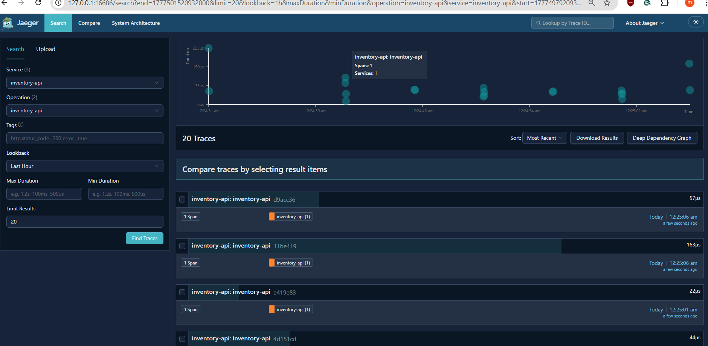
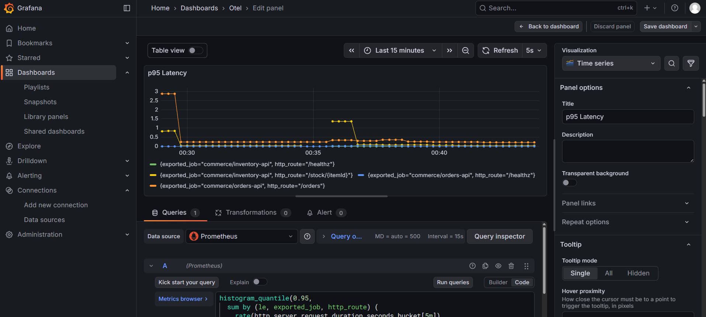
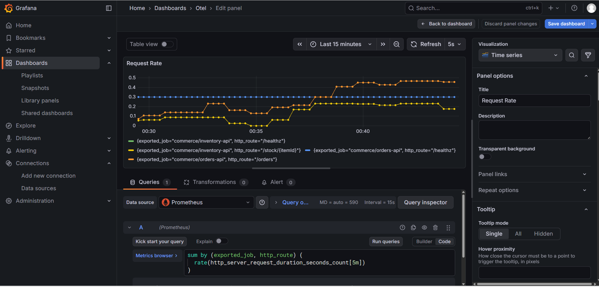

# otel-heterogeneous-reference

> Reference implementation of a Maturity-Driven Enterprise Adoption Framework for OpenTelemetry across heterogeneous services.


**Status**: v1 complete. v2 (GitOps + full CI/CD loop) in progress. See [Roadmap](#roadmap).

---

## What this is

An end-to-end reference implementation proving that enterprise OpenTelemetry adoption requires more than the SDK — it requires a **Minimum Viable Standard (MVS)**, a **vendor-neutral architecture**, a **governance model**, and a **standardization strategy**.

Companion artifact to an ongoing Master's thesis on enterprise observability standardization in heterogeneous IT landscapes (HTW Berlin / Metropolia, industry placement: Hugo Boss).

---

## What this proves

| Capability | Implementation | Evidence |
|---|---|---|
| MVS compliance enforcement | `tests/mvs_compliance.py` — 4 rules, pytest | `docs/evidence/pipeline/` |
| CI/CD pipeline | Azure DevOps → builds → pushes to ACR → updates Git | `azure-pipelines.yml` |
| GitOps deployment | ArgoCD auto-syncs `k8s/base/` to cluster | `docs/evidence/argocd/` |
| Drift correction | ArgoCD reverts manual kubectl changes to match Git | `docs/evidence/argocd/` |
| Self-hosted CI | Jenkins with Docker agents, Poll SCM auto-trigger | `Jenkinsfile` |
| Self-hosted registry | Harbor v2.10 as on-premise ACR alternative | `docs/evidence/harbor/` |
| Self-healing K8s | Deployment recreates deleted Pods automatically | `docs/evidence/kubernetes/` |
| Chaos engineering | Controlled failure with post-mortem | `docs/chaos/` |

---

## Architecture

The system consists of:
- **orders-api** — .NET 8 minimal API, calls inventory-api to validate stock
- **inventory-api** — Go service returning stock availability
- **OpenTelemetry Collector** — agent (DaemonSet) + gateway (Deployment) pattern
- **Jaeger** — trace backend
- **Prometheus + Alertmanager** — metrics and SLO-based alerting
- **Loki** — log aggregation
- **Grafana** — single pane of glass across all three signals
- **ArgoCD** — GitOps engine managing `k8s/base/` deployments
- **Azure DevOps** — CI pipeline with MVS compliance gate

---

## Full CI/CD Loop

Code push → Azure DevOps pipeline:

1.MVS compliance tests (4 rules, pytest) — gates every merge
2.Docker build + push orders-api → ACR
3.Docker build + push inventory-api → ACR
4.Auto-update image tags in k8s/base/ → GitHub [skip ci]
↓
ArgoCD detects Git change → auto-syncs → deploys to cluster


---

## Why this exists

Most observability tutorials instrument a single service in a single language. Real enterprises run heterogeneous stacks — .NET, Java, Go, Python — with inconsistent telemetry conventions, unreliable trace propagation, and dashboards that don't compose across teams.

This project demonstrates a different approach: **define the standard first (MVS), enforce it in CI, implement identically across languages, deploy via GitOps, keep the backend plug-replaceable.**

---

## Quick start

```bash
docker compose up --build
curl -X POST http://localhost:8080/orders \
  -H "Content-Type: application/json" \
  -d '{"itemId":"sku-123","qty":2}'
```

Two services start, orders-api calls inventory-api, and a single trace ID flows through both — verifying end-to-end W3C trace context propagation across .NET and Go.

---

## Live demo

### Distributed tracing in Jaeger


### RED metrics in Grafana



---

## Documentation

- **[Telemetry Minimum Standard (MVS)](docs/telemetry-mvs.md)** — the standard every service must conform to
- **[SLO definitions](docs/slos.md)** — availability and latency targets with burn-rate alerts
- **[Chaos experiments](docs/chaos/)** — documented failure scenarios with post-mortems
- **[Known issues](docs/known_issues.md)** — documented debugging investigations
- **[Architectural decisions](DECISIONS.md)** — ADR log explaining key choices
- **[Evidence](docs/evidence/)** — screenshots proving every tool actually runs

---

## Roadmap

### v1 — Complete ✅
- Multi-language OTel instrumentation (.NET + Go)
- MVS document v0.1 with automated compliance tests
- OTel Collector agent/gateway pattern
- Jaeger, Prometheus, Loki, Grafana stack
- Chaos engineering experiment with post-mortem

### v2 — In progress 🔄
- [x] Azure DevOps CI/CD pipeline with MVS compliance gate
- [x] Docker build + push to Azure Container Registry
- [x] ArgoCD GitOps deployment with auto-sync and drift correction
- [x] Full CI/CD loop (pipeline auto-updates Git → ArgoCD deploys)
- [x] Jenkins self-hosted CI (on-premise enterprise scenario)
- [x] Harbor self-hosted registry (on-premise ACR alternative)
- [ ] Remaining MVS rules (span attributes, RED metrics, log/trace correlation)
- [ ] AKS deployment (cloud Kubernetes)
- [ ] Sealed Secrets (encrypted secrets in Git)
- [ ] OTel Collector deployed to Kubernetes cluster

---

## Repository structure

├── apps/
│   ├── orders-api/          # .NET 8 service
│   └── inventory-api/       # Go service
├── k8s/
│   ├── base/                # ArgoCD-managed Kubernetes manifests
│   ├── kind/                # Local kind cluster manifests
│   └── observability/       # OTel Collector, Prometheus, Grafana
├── tests/
│   ├── conftest.py          # OTLP receiver fixture
│   └── mvs_compliance.py    # MVS compliance test suite
├── docs/
│   ├── telemetry-mvs.md     # MVS specification v0.1
│   ├── chaos/               # Chaos experiment post-mortems
│   ├── evidence/            # Screenshots proving tools work
│   └── known_issues.md      # Documented debugging investigations
├── azure-pipelines.yml      # Azure DevOps CI/CD pipeline
└── Jenkinsfile              # Jenkins self-hosted CI pipeline
